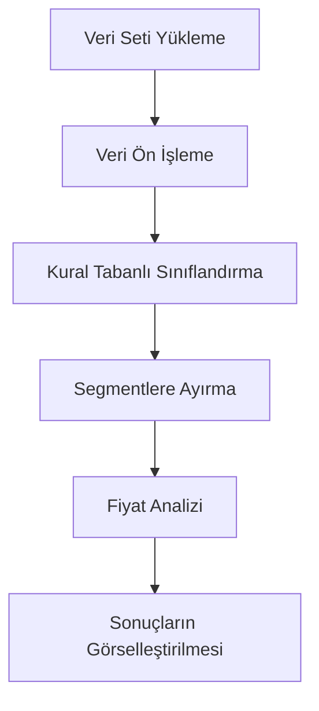

# 🎯 Rule-Based Classification Projesi

📌 **Bu proje**, belirli kurallar ve sınıflandırma yöntemleri kullanarak veriler üzerinde **otomatik sınıflandırma** yapmayı amaçlayan bir **Python** çalışmasıdır.  
💻 **Jupyter Notebook** formatında geliştirilmiş olup, veri analizi, sınıflandırma ve görselleştirme adımlarını **adım adım** içermektedir.

---

## 📚 İçindekiler

- [📌 Proje Hakkında](#-proje-hakkında)  
- [🛠 Kullanılan Teknolojiler](#-kullanılan-teknolojiler)  
- [⚙️ Kurulum](#%EF%B8%8F-kurulum)  
- [🚀 Kullanım](#-kullanım)  
- [📊 Veri Seti](#-veri-seti)  
- [📈 Sonuçlar](#-sonuçlar)  
- [🔄 Çalışma Akışı](#-çalışma-akışı)   

---

## 📌 Proje Hakkında

Bu proje kapsamında:  

✅ Verilen veriler üzerinde **önceden tanımlanmış kurallara dayalı sınıflandırma** yapılmıştır.  
✅ Farklı segmentasyonlar, fiyat analizleri ve karşılaştırmalar gerçekleştirilmiştir.  
✅ Sonuçlar **grafikler** ve **tablolar** ile sunulmuştur.

> 🔍 **Amaç:** Kural tabanlı yaklaşımlarla verileri anlamlı segmentlere ayırmak ve analiz etmektir.

---

## 🛠 Kullanılan Teknolojiler

| Teknoloji | Açıklama |
|-----------|----------|
| **Python 3.x** | Ana programlama dili |
| **Jupyter Notebook** | Çalışma ortamı |
| **Pandas** | Veri analizi |
| **NumPy** | Sayısal hesaplamalar |
| **Matplotlib / Seaborn** | Veri görselleştirme |

---

## ⚙️ Kurulum

1️⃣ **Python** ve **Jupyter Notebook** bilgisayarınızda kurulu değilse yükleyin.  
2️⃣ Projeyi klonlayın veya indirin:  

```bash
git clone https://github.com/Memreu/Rule-Based-Classification.git
cd Rule-Based-Classification
```

3️⃣ Gerekli kütüphaneleri yükleyin:  

```bash
pip install pandas numpy matplotlib seaborn
```

---

## 🚀 Kullanım

💡 **Notebook dosyası** içerisinde adım adım kod blokları ve açıklamalar mevcuttur.  

1. `rule_based_classification.ipynb` dosyasını Jupyter Notebook ile açın.  
2. Kod hücrelerini **sırasıyla çalıştırın**.  
3. Kendi verinizi kullanmak isterseniz veri yükleme adımındaki **dosya yolunu** değiştirin.  

> ⚠️ Notebook içerisinde **örnek veri seti** yüklüdür, fakat kendi verilerinizle de kolayca çalıştırabilirsiniz.

---

## 📊 Veri Seti

📂 Veri seti, **fiyat** ve **segmentasyon bilgilerini** içeren tablolardan oluşur.  
Kendi veri setinizi kullanmak için:

- Notebook içindeki veri yükleme kısmını düzenleyin  
- CSV, Excel veya başka formatlarda veri yükleyebilirsiniz  

---

## 📈 Sonuçlar

📌 Proje sonucunda:  

1. Veriler, belirlenen **kurallara göre segmentlere** ayrıldı.  
2. Segment bazlı **fiyat analizi** yapıldı.  
3. Sonuçlar **grafik** ve **tablo** formatında görselleştirildi.  

---

## 🔄 Çalışma Akışı

Aşağıda, projenin genel işleyişini gösteren bir akış diyagramı bulunmaktadır:  



